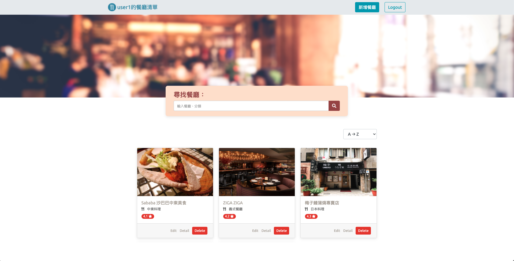

## Retaurant List
<div align="center">
  
</div>

### Features
1. User can register account or login with Facebook
2. User can manage the list by creating, editing and deleting restaurant from the list
3. User can search and sort the restaurants 
### Setup
Activate MongoDB 

```bash
$ cd ~/mongodb/bin/
$ ./mongod --dbpath ~/mongodb-data
```

Clone the repo and install the dependencies.

```bash
$ git clone https://github.com/r05323045/restaurant_list.git
$ cd restaurant_list
```
then
```bash
$ npm install
```

To start the express server and use seed data, run the following

```bash
$ npm run seed
$ npm run dev
```

Open [http://localhost:3000](http://localhost:3000) and take a look around